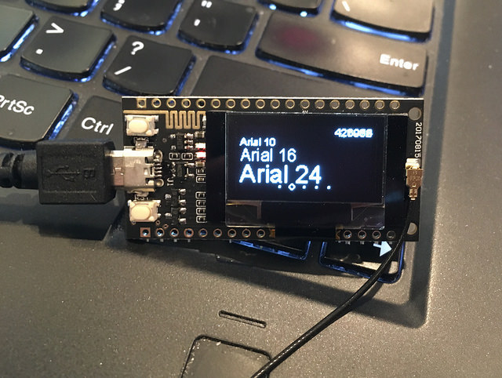
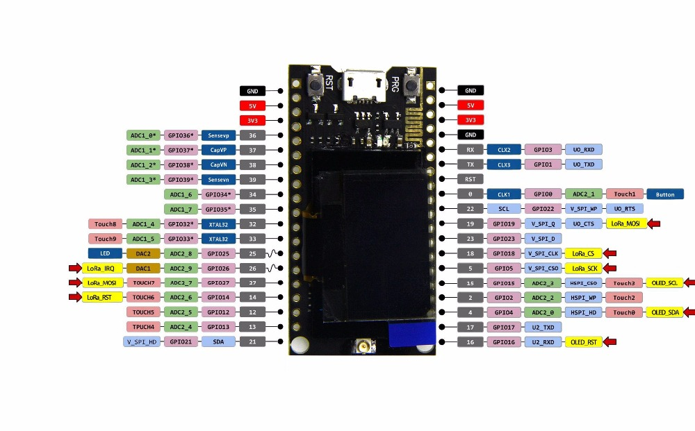
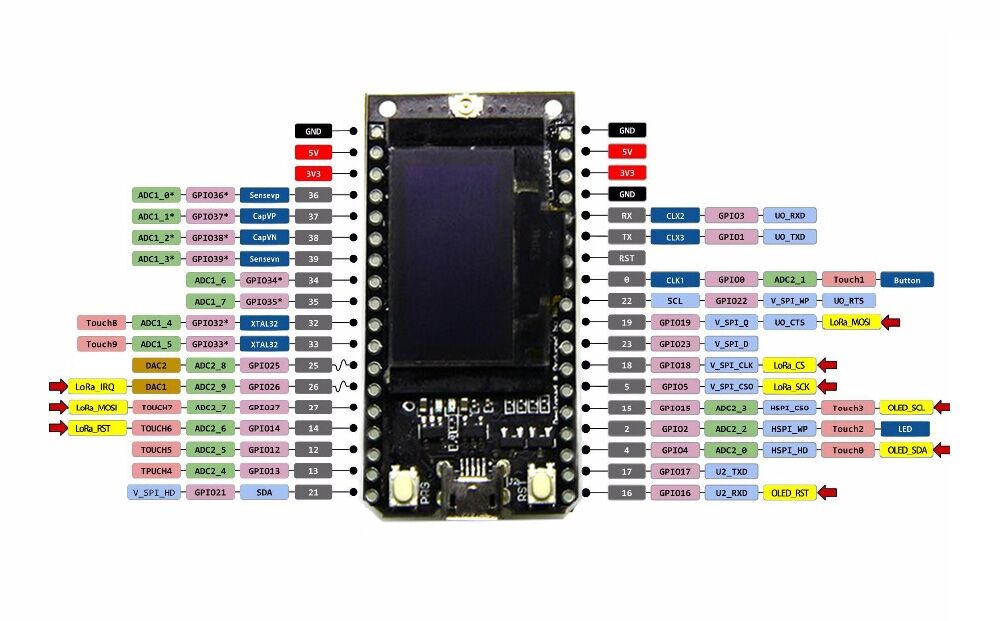
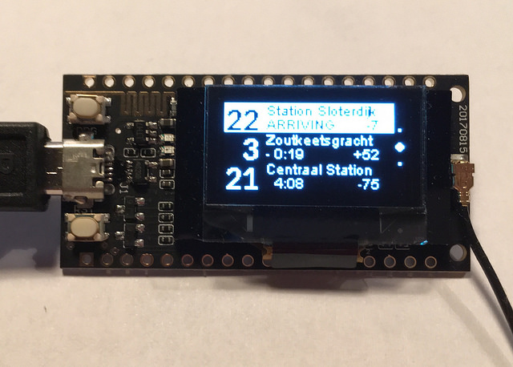
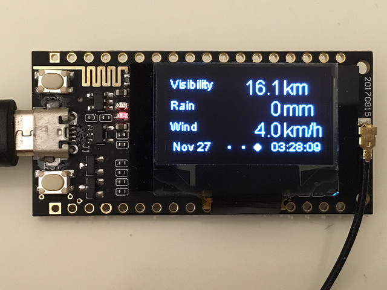

ESP32 + OLED + LoRa module from TT GO
===

These $10 ESP32 modules from various aliexpress sellers [(one example)](https://www.aliexpress.com/item/2pcs-TTGO-LORA-SX1278-ESP32-0-96-OLED-16-Mt-bytes-128-Mt-bit-433Mhz-for/32833821668.html)
have a SSD1306 128x64 white OLED display and a SX1278 LoRa radio module.
They also include a LiPo battery charger and two buttons (one is wired to
reset, so it isn't as useful).  There is a slightly more [expensive version
with a blue OLED](https://www.aliexpress.com/item/2pcs-of-868MHz-915MHz-SX1276-ESP32-LoRa-0-96-Inch-Blue-OLED-Display-Bluetooth-WIFI-Kit/32840618066.html)
with a 900 Mhz radio.

It is programmable with the normal ESP32 Arduino IDE, using
the board type `ESP32 Dev Module` and programmable over the
`/dev/ttyUSB0` port.  On OSX and Windows you might need to install
a driver for the CP2102 USB to UART bridge from Silicon Labs.

Libraries
===
The official devkit is a 300 MB download, but if you have already setup
ESP32 on your Arduino IDE then you just need to install the libraries
for the OLED and LoRa (in the [`libraries/`](libraries/) directory of
this tree).  From the Arduino IDE select
`Sketch`-`Include Libaries`-`Add .zip library`
and select the libraries zips.

It would be nice to make the `Adafruit_SSD1306` library work with this
module so that it isn't necessary to install anything extra.  It looks like
they hacked up the Adafruit library to make their own.

The LoRa library might not be as hacked up.  Haven't investigated it yet.

The other libraries should be pre-installed, such as the `Preferences`
to access the ESP32 non-volatile storage, and the `Wire` library for
i2c communication.

Pinout
===
The 400 MHz version with the white OLED:

The 900 MHz version with the blue OLED is almost exactly backwards.
Be sure to note that the components are turned around if you plan to try both
modules.

The ad copy says something about a touch screen:

    Using the IO port touch screen touch signal input,
    you need to add the 100nF pull-down capacitor at
    this pin!

There doesn't seem to be any discussion of it in the SDK, nor is it
described with pin needs to pull-down.

OLED notes
===

The reset pin on the OLED needs to be controlled by the sketch. It does
not seem to be included in the library.  Pin 16 is the reset line and
it should be brought low for a few ms, then held high the entire time
the screen is to remain on.

	#include <Wire.h>
	#include <SSD1306.h>
	#include <OLEDDisplayUi.h>

	// OLED pins to ESP32 GPIOs via this connecthin:
	#define OLED_ADDRESS 0x3c
	#define OLED_SDA 4 // GPIO4
	#define OLED_SCL 15 // GPIO15
	#define OLED_RST 16 // GPIO16

	SSD1306 display(OLED_ADDRESS, OLED_SDA, OLED_SCL);
	OLEDDisplayUi ui( &display );

	void setup()
	{
		pinMode(OLED_RST,OUTPUT);
		digitalWrite(OLED_RST, LOW); // low to reset OLED
		delay(50); 
		digitalWrite(OLED_RST, HIGH); // must be high to turn on OLED
		// ....
	}

Demos
===

The [SSD1306 demo](demo/SSD1306UiDemo/) should work once
you've install the OLED library.

This demo uses the web socket API from [GVB maps](https://maps.gvb.nl/) to
track the next buses and trams arriving.  A hacked up version of the
ArduinoWebSocket library is included to make it work with the esp32 and SSL.
This should be pushed upstream.

The [Weather demo](demo/Weather/) is derived from
[G6EJD's Weather Station](https://github.com/G6EJD/ESP32-Weather-Station-using-1.3-OLED)
and requires both a [Weather Underground API key](https://www.wunderground.com/weather/api/)
as well as your local WiFi credentials.

